# Student Management Information System (MIS) 📚

## 📌 Project Overview

The **Student Management Information System (MIS)** is a robust solution built using **Angular 19**, **Node.js**, and **MySQL**. It offers role-based user management and supports CRUD operations for entities like students, instructors, and administrators. The system also includes a dynamic report generator for extracting insights from the data.

This project aims to streamline student management for educational institutions by providing a user-friendly interface to manage student records, instructors, and administrative tasks.

---
## Original Author

This project was originally created by Parshwa Herwade on 24-03-2025.

All original code & design are the intellectual property of Parshwa Herwade.

---
## License

This project is licensed under the MIT License. See the `LICENSE` file for details.

---

## 🚀 Features

- **Role-Based Authentication** (Admin, Instructor, Student)
- **User Registration & Login System**
- **CRUD Operations** for Student, Instructor, and Admin Data
- **MySQL Database Integration**
- **Dynamic Report Generation**
- **RESTful API** using Node.js & Express
- **Responsive UI** with Angular 19
- **Secure API** with JWT Authentication
- **SQL Schema Included** (Pre-configured for easy setup)

---

## 🛠️ Tech Stack

- **Frontend**: Angular 19, TypeScript, Bootstrap
- **Backend**: Node.js, Express.js
- **Database**: MySQL
- **Authentication**: JWT (JSON Web Tokens)

---

## 📥 Installation & Setup

### 1️⃣ Set Up the Database

1. Open MySQL and create a database:
    ```sql
    CREATE DATABASE student_mis;
    ```
2. Import the provided schema:
    ```bash
    mysql -u root -p student_mis < database/mis1.sql
    ```

#### Importing `mis1.sql` into MySQL

**Windows (Command Prompt / PowerShell):**
1. Open Command Prompt or PowerShell.
2. Navigate to the project directory:
    ```bash
    cd path/to/your/project/database
    ```
3. Run the MySQL command:
    ```bash
    mysql -u root -p student_mis < mis1.sql
    ```
4. Enter your MySQL root password when prompted.

**Mac/Linux (Terminal):**
1. Open Terminal.
2. Navigate to the project directory:
    ```bash
    cd path/to/your/project/database
    ```
3. Run the command:
    ```bash
    mysql -u root -p student_mis < mis1.sql
    ```
4. Enter your MySQL root password when prompted.

**Using MySQL Workbench:**
1. Open MySQL Workbench and connect to your MySQL Server.
2. Select the `student_mis` database.
3. Go to `File > Open SQL Script` and select `mis1.sql`.
4. Click `Execute` to run the script.

---

### 2️⃣ Run the Backend Server

1. Navigate to the backend directory:
    ```bash
    cd backend
    ```
2. Install dependencies:
    ```bash
    npm install
    ```
3. Start the server:
    ```bash
    node server.js
    ```
    The Express.js API will now be running at `http://localhost:3000`.

---

### 3️⃣ Run the Frontend

1. Navigate to the frontend directory:
    ```bash
    cd frontend
    ```
2. Install dependencies:
    ```bash
    npm install
    ```
3. Start the Angular app:
    ```bash
    ng serve
    ```
    The Angular 19 app will now be running at `http://localhost:4200`.

---

## 🖥️ Usage Guide

1. Open `http://localhost:4200` in your browser.
2. Login as Admin, Instructor, or Student using sample credentials.
3. Explore dashboards – Add students, manage courses, and view reports!

---

## 📸 Screenshots

### Admin Features
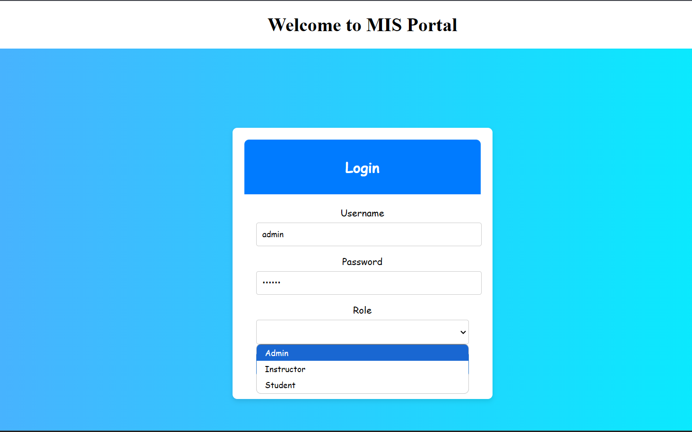
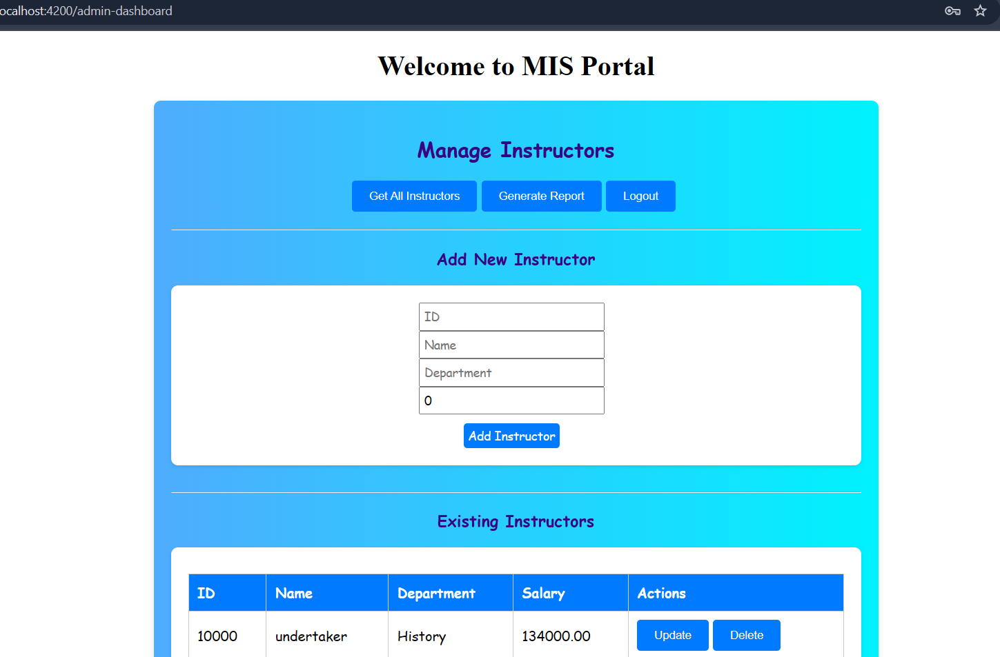
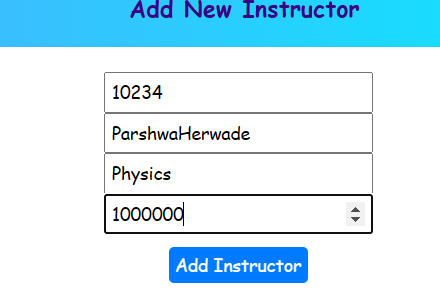
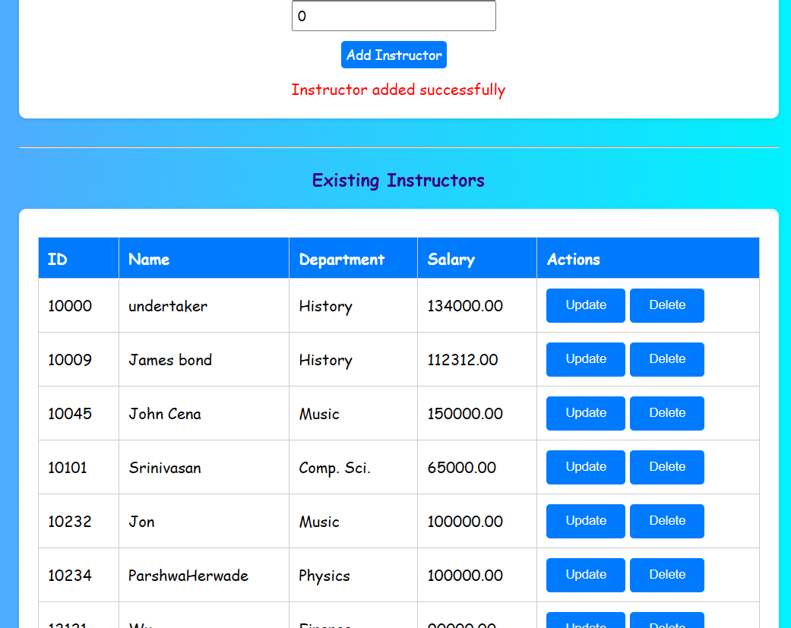
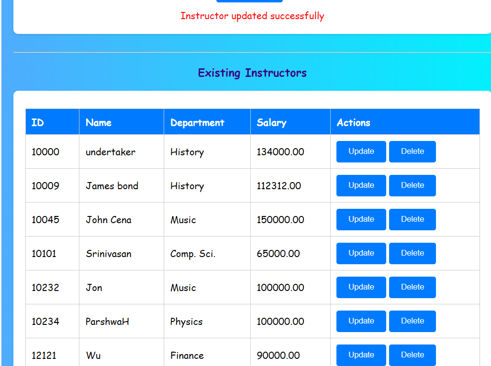
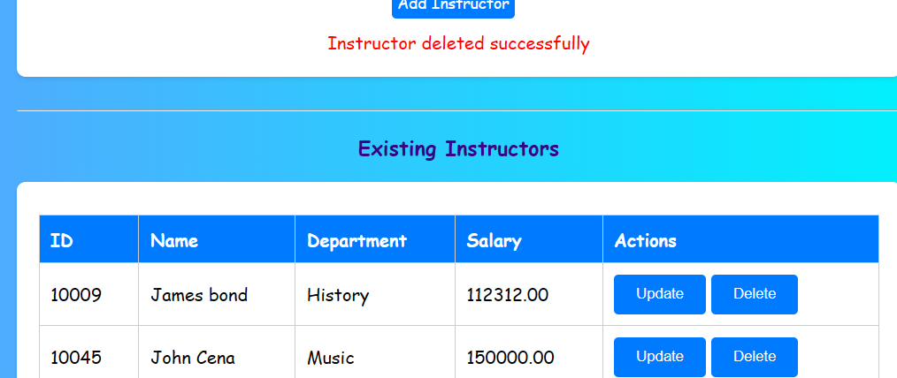

### Report Generation
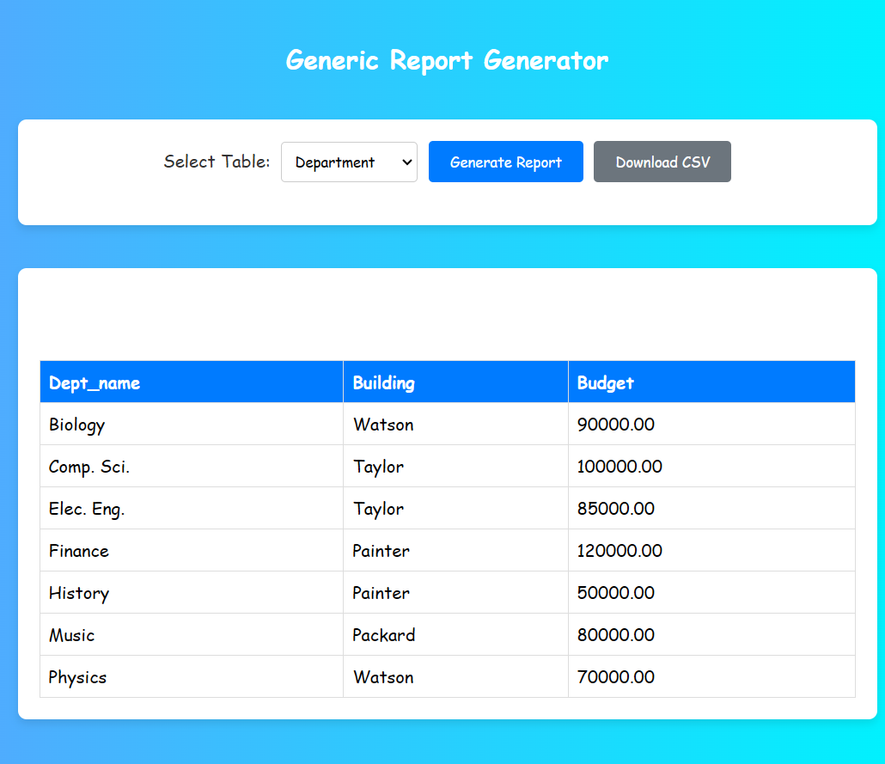
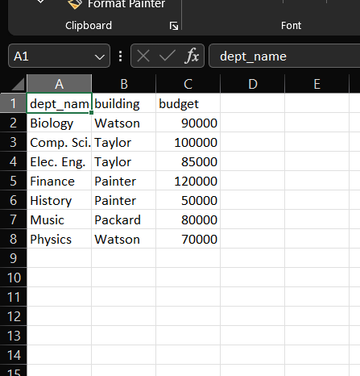

### Instructor Features
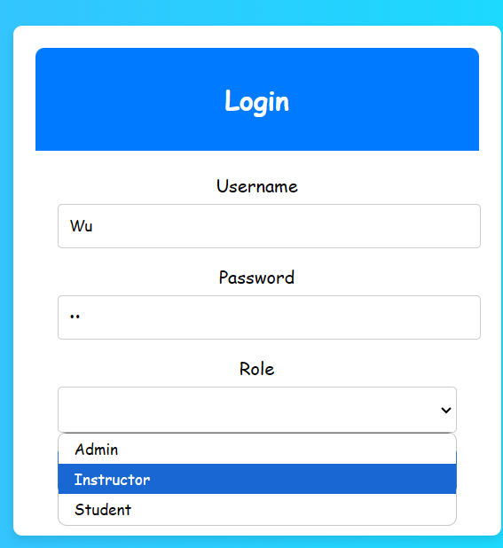
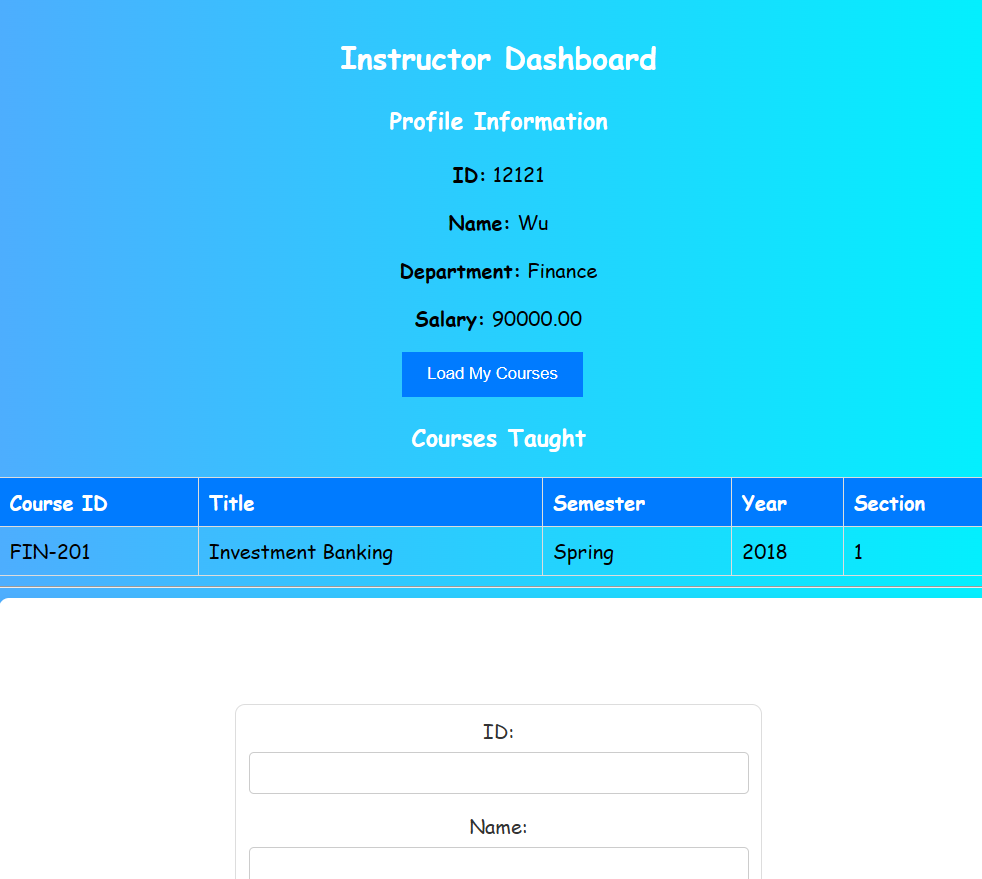
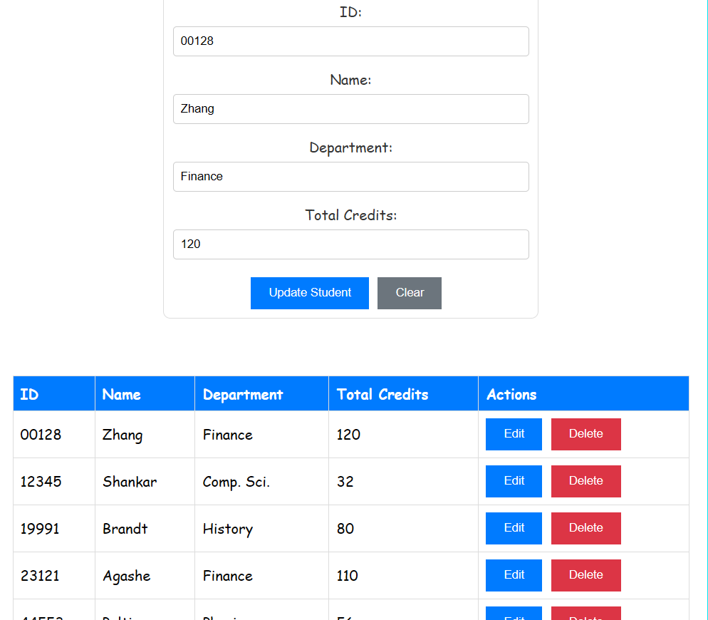

### Student Features
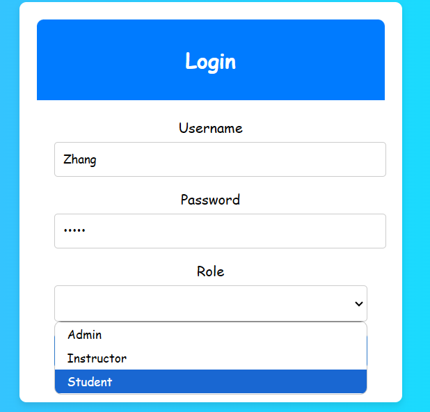
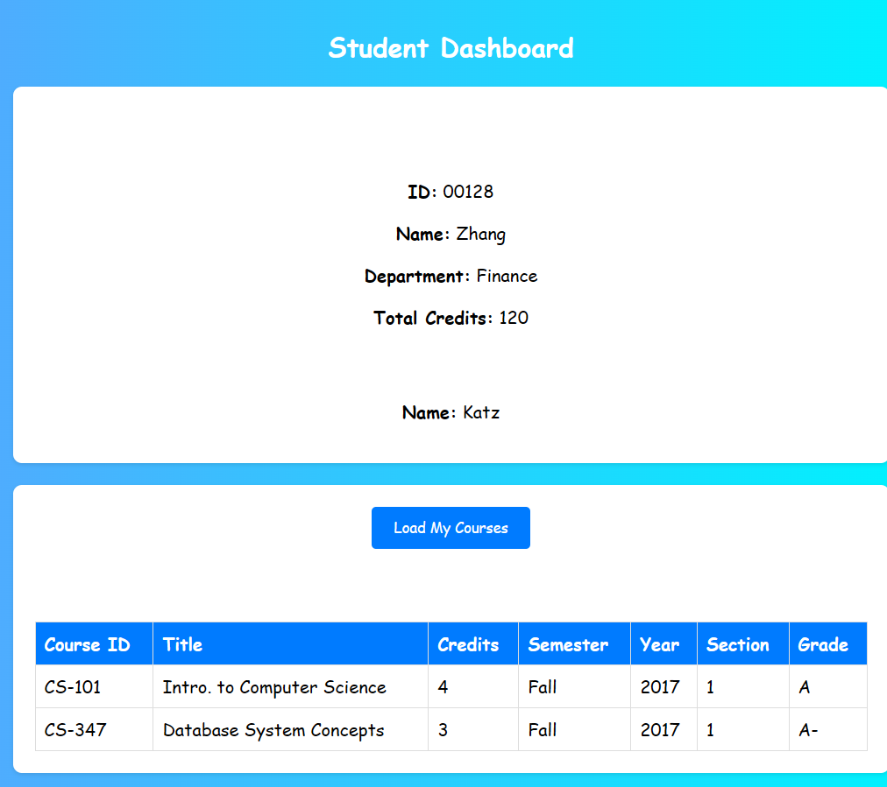

---

## 🎯 Future Enhancements

- **Student Attendance Module** – Track attendance efficiently.
- **Grading System** – Enable instructors to assign grades.
- **Advanced Analytics** – Generate more insightful reports.

---

## 💻 Development Guide

### Development Server

To start a local development server, run:
```bash
ng serve
```
Navigate to `http://localhost:4200/` in your browser. The application will automatically reload whenever you modify any source files.

---

### Code Scaffolding

To generate a new component, run:
```bash
ng generate component component-name
```
For a complete list of available schematics, run:
```bash
ng generate --help
```

---

### Building the Project

To build the project, run:
```bash
ng build
```
The build artifacts will be stored in the `dist/` directory. The production build optimizes the application for performance and speed.

---

### Running Unit Tests

To execute unit tests with the [Karma](https://karma-runner.github.io) test runner, use:
```bash
ng test
```

---

### Running End-to-End Tests

For end-to-end (e2e) testing, run:
```bash
ng e2e
```
> **Note:** Angular CLI does not include an end-to-end testing framework by default. Choose one that suits your needs.

---

## 📚 Additional Resources

For more information on using the Angular CLI, visit the [Angular CLI Overview and Command Reference](https://angular.dev/tools/cli).

---

## MisPortal (Student Management System Portal)

This project was generated using [Angular CLI](https://github.com/angular/angular-cli) version 19.1.1.

---
